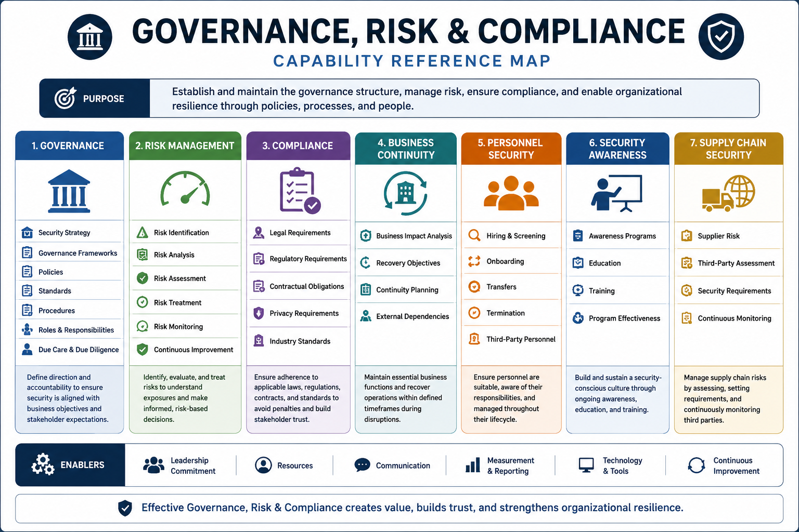

# Governance, Risk & Compliance

Governance, Risk & Compliance (GRC) provides the strategic foundation for enterprise security programs. It establishes how organizations align security objectives with business goals, manage risk, satisfy legal and regulatory obligations, and create sustainable security practices.

This capability focuses on leadership, governance, risk management, compliance, business continuity, personnel security, and organizational security culture.

## Capability Reference Map



# Why This Capability Matters

Technology alone does not create security.

Organizations must establish governance structures, risk management processes, policies, standards, accountability, and oversight mechanisms that guide security decisions across the enterprise.

Governance ensures security supports business objectives.

Risk management enables informed decision-making.

Compliance ensures adherence to legal, regulatory, and contractual obligations.

Together, these capabilities form the foundation of enterprise security.

---

# Architecture Perspective

Security architecture begins with business requirements.

Before selecting technologies or implementing controls, organizations must understand:

* Business objectives
* Risk tolerance
* Regulatory obligations
* Governance requirements
* Operational constraints

Security controls exist to address business risk.

```text
Business Objectives
        ↓
Governance
        ↓
Risk Management
        ↓
Policies
        ↓
Standards
        ↓
Controls
        ↓
Monitoring
        ↓
Continuous Improvement
```

---

# Domain Coverage

This domain includes the following major areas:

## Ethics & Professional Responsibility

* Professional ethics
* Organizational ethics
* Accountability
* Professional conduct

---

## Core Security Principles

* Confidentiality
* Integrity
* Availability
* Authenticity
* Nonrepudiation

---

## Security Governance

* Business alignment
* Governance structures
* Roles and responsibilities
* Security frameworks
* Due care
* Due diligence

---

## Legal, Regulatory & Privacy Requirements

* Legal requirements
* Regulatory obligations
* Privacy considerations
* Intellectual property
* Data protection
* Cross-border data transfers

---

## Investigations & Evidence Management

* Administrative investigations
* Civil investigations
* Criminal investigations
* Regulatory investigations
* Evidence handling
* Documentation

---

## Security Documentation Framework

* Policies
* Standards
* Procedures
* Guidelines

---

## Business Continuity & Resilience

* Business Impact Analysis (BIA)
* Business Continuity Planning (BCP)
* External dependencies
* Operational resilience

---

## Personnel & Workforce Security

* Screening
* Hiring
* Onboarding
* Transfers
* Termination
* Third-party personnel requirements

---

## Enterprise Risk Management

* Threat identification
* Vulnerability identification
* Risk assessment
* Risk treatment
* Risk monitoring
* Risk reporting

---

## Threat Modeling & Risk Analysis

* Threat identification
* Attack surface analysis
* Trust boundaries
* Threat scenarios

---

## Supply Chain Security

* Third-party risk
* Vendor management
* Product assurance
* Supply chain integrity
* Security monitoring

---

## Security Awareness & Culture

* Security awareness
* Training programs
* Social engineering awareness
* Security champions
* Program effectiveness

---

# Security Decision Patterns

## Governance vs Management

Governance defines strategic direction.

Management executes operational activities.

---

## Due Care vs Due Diligence

Due Care:

Taking appropriate action.

Due Diligence:

Demonstrating appropriate action was taken.

---

## Risk Mitigation vs Risk Avoidance

Risk Mitigation:

Reduce risk.

Risk Avoidance:

Eliminate the activity causing risk.

---

## Policy vs Standard

Policy:

High-level requirement.

Standard:

Mandatory implementation requirement.

---

## Procedure vs Guideline

Procedure:

Required process.

Guideline:

Recommended approach.

---

# Related Security Architecture Patterns

This domain directly supports:

* Security Governance Model
* Risk Management Process
* Defense in Depth
* Zero Trust Architecture
* Business Continuity & Disaster Recovery
* Shared Responsibility Model

Refer to:

`references/security-architecture-patterns.md`

for detailed architecture patterns.

---

# Key Takeaways

* Security must support business objectives.
* Governance drives security strategy.
* Risk management enables informed decision-making.
* Policies establish direction; controls enforce requirements.
* Compliance is a business requirement.
* Security culture influences organizational resilience.
* Continuous improvement is essential for long-term effectiveness.

---

# Related Domains

This domain has strong relationships with:

* Security Architecture & Engineering
* Identity & Access Security
* Security Operations & Resilience
* Security Assessment & Validation

Governance and risk management influence every security domain within the enterprise.
