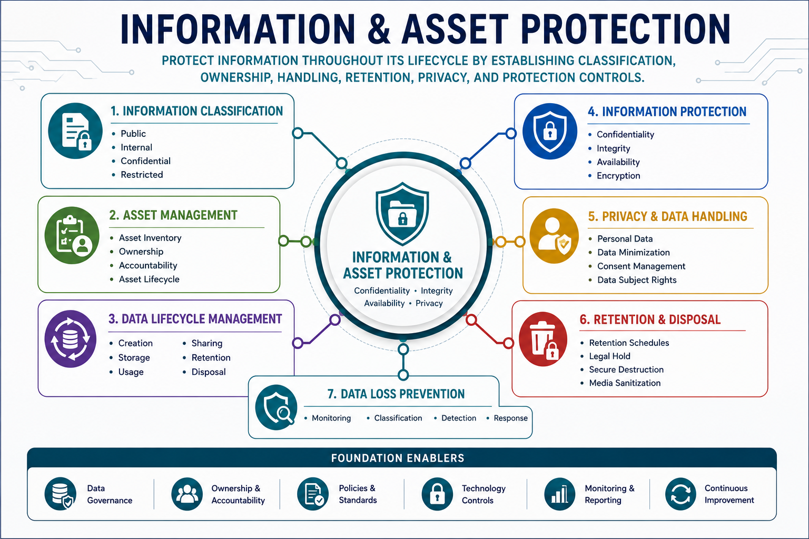

# Information & Asset Protection

Information and Asset Protection focuses on identifying, classifying, handling, protecting, retaining, and disposing of information and organizational assets throughout their lifecycle.

This domain establishes the controls and governance necessary to ensure that information assets remain protected, properly managed, and aligned with business, legal, regulatory, and operational requirements.

## Capability Reference Map



---

# Why This Capability Matters

Information is one of the most valuable assets within an organization.

Effective protection requires understanding:

* What information exists
* Who owns it
* How it should be handled
* Where it resides
* How long it should be retained
* How it should be securely destroyed

Organizations must manage information throughout its entire lifecycle while maintaining confidentiality, integrity, availability, privacy, and compliance requirements.

---

# Architecture Perspective

Information protection begins with understanding asset value and classification.

Security controls should be applied according to business requirements, regulatory obligations, and risk considerations.

```text
Information
        ↓
Classification
        ↓
Ownership
        ↓
Handling Requirements
        ↓
Protection Controls
        ↓
Retention
        ↓
Destruction
```

---

# Cabability Coverage

This domain includes the following major areas:

## Information Classification

* Data classification
* Sensitivity levels
* Business value
* Handling requirements

---

## Asset Classification

* Physical assets
* Digital assets
* Intellectual property
* Information assets

---

## Information Handling Requirements

* Storage requirements
* Transmission requirements
* Access requirements
* Protection requirements

---

## Asset Ownership & Accountability

* Information owners
* Data custodians
* Data processors
* Data users

---

## Asset Inventory Management

* Hardware assets
* Software assets
* Cloud resources
* Information repositories

---

## Data Lifecycle Management

* Data creation
* Data usage
* Data sharing
* Data storage
* Data archival
* Data destruction

---

## Data Protection Controls

* Encryption
* Data Loss Prevention (DLP)
* Digital Rights Management (DRM)
* Cloud Access Security Broker (CASB)

---

## Data States

* Data at Rest
* Data in Transit
* Data in Use

---

## Retention & Disposal

* Retention requirements
* End-of-Life (EOL)
* End-of-Support (EOS)
* Secure destruction
* Data remanence considerations

---

## Compliance & Privacy

* Regulatory requirements
* Privacy obligations
* Data residency
* Cross-border data handling

---

# Security Decision Patterns

## Data Classification vs Asset Classification

Data Classification:

Classifies information based on sensitivity and business impact.

Asset Classification:

Classifies organizational assets based on value and criticality.

---

## Data Owner vs Custodian

Data Owner:

Responsible for classification and business requirements.

Custodian:

Responsible for implementation and protection.

---

## Retention vs Archival

Retention:

Required preservation period.

Archival:

Long-term storage method.

---

## Data Destruction vs Data Remanence

Data Destruction:

Intentional removal of information.

Data Remanence:

Residual information that may remain after deletion.

---

# Related Security Architecture Patterns

This domain directly supports:

* Data Lifecycle Management
* Information Classification Models
* Data Protection Frameworks
* Privacy Management Programs
* Information Governance
* Asset Management Processes

Refer to:

`references/security-architecture-patterns.md`

for related architecture patterns.

---

# Key Takeaways

* Information is a critical business asset.
* Classification drives protection requirements.
* Ownership establishes accountability.
* Protection controls must align with risk and business value.
* Information must be managed throughout its lifecycle.
* Retention and disposal processes are essential for compliance and security.
* Privacy requirements influence information protection strategies.

---

# Related Domains

This domain has strong relationships with:

* Governance, Risk & Compliance
* Security Architecture & Engineering
* Identity & Access Security
* Security Operations & Resilience

Effective information protection requires governance, architecture, access controls, monitoring, and operational oversight.
