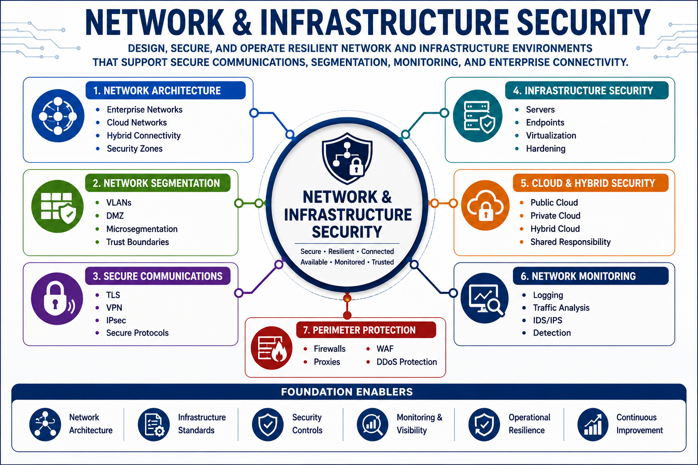

# Network & Infrastructure Security

Network & Infrastructure Security focuses on protecting the systems, networks, communications channels, and supporting infrastructure that enable modern business operations. It establishes secure connectivity, controls traffic flows, enforces trust boundaries, and provides visibility across enterprise environments.

This capability encompasses network architecture, segmentation, secure communications, cloud networking, wireless security, infrastructure protection, and network monitoring.
## Capability Reference Map



---

# Why This Capability Matters

Modern organizations depend on interconnected systems, cloud platforms, remote users, business partners, and distributed applications.

Without effective network and infrastructure security:

* Critical systems become exposed
* Sensitive information may be compromised
* Attackers can move laterally across environments
* Operational resilience is reduced
* Business services become unavailable

Network and infrastructure security establish the protective foundation that enables secure business operations.

---

# Architecture Perspective

Network security begins with understanding trust boundaries, communication paths, and business requirements.

Security controls should be applied throughout the infrastructure to reduce risk, limit attack propagation, and improve visibility.

```text
Business Services
         ↓
Network Architecture
         ↓
Segmentation
         ↓
Access Controls
         ↓
Monitoring
         ↓
Detection & Response
```

---

# Core Functions

## Network Architecture

* Enterprise network design
* Layered architectures
* Network topologies
* Transport architectures
* Data, control, and management planes

---

## Secure Communications

* TLS
* IPSec
* SSH
* VPN technologies
* Secure remote access
* Secure application communications

---

## Network Segmentation

* Physical segmentation
* Logical segmentation
* VLANs
* Virtual routing and forwarding (VRF)
* Micro-segmentation
* Zero Trust segmentation

---

## Traffic Flow Security

* North-South traffic
* East-West traffic
* Ingress controls
* Egress controls
* Trust boundaries
* Secure routing

---

## Infrastructure Security

* Routers
* Switches
* Firewalls
* Load balancers
* Network access controls
* Endpoint protections

---

## Wireless & Mobile Security

* Wi-Fi security
* Bluetooth security
* Mobile communications
* Cellular technologies
* Wireless access controls

---

## Cloud Networking

* Virtual Private Clouds (VPC)
* Virtual Networks (VNet)
* Hybrid connectivity
* Network virtualization
* Software-defined networking (SDN)
* Secure cloud communications

---

## Monitoring & Observability

* Network monitoring
* Traffic analysis
* Flow monitoring
* Capacity management
* Fault detection
* Network observability

---

# Security Decision Patterns

## North-South vs East-West Traffic

North-South:

Traffic entering or leaving the environment.

East-West:

Traffic moving within the environment.

---

## Physical vs Logical Segmentation

Physical:

Separation through dedicated infrastructure.

Logical:

Separation through configuration and virtualization.

---

## VPN vs TLS

VPN:

Protects network communications.

TLS:

Protects application and session communications.

---

## IDS vs IPS

IDS:

Detects suspicious activity.

IPS:

Detects and actively blocks suspicious activity.

---

## Router vs Firewall

Router:

Moves traffic between networks.

Firewall:

Enforces security policy.

---

# Related Security Architecture Patterns

This capability directly supports:

* Defense in Depth
* Zero Trust Architecture
* Network Segmentation
* Secure Access Architecture
* Security Monitoring Model
* Shared Responsibility Model

Refer to:

`references/security-architecture-patterns.md`

for related architecture patterns.

---

# Key Takeaways

* Network security enables secure business communications.
* Segmentation reduces attack propagation.
* Infrastructure components enforce trust boundaries.
* Secure protocols protect information in transit.
* Monitoring provides visibility into network activity.
* Cloud networking introduces new security considerations.
* Network security must align with business and architectural requirements.

---

# Related Capabilities

This capability has strong relationships with:

* Governance, Risk & Compliance
* Security Architecture & Engineering
* Identity & Access Security
* Security Operations & Resilience

Effective network security depends on strong architecture, identity controls, operational monitoring, and governance oversight.
