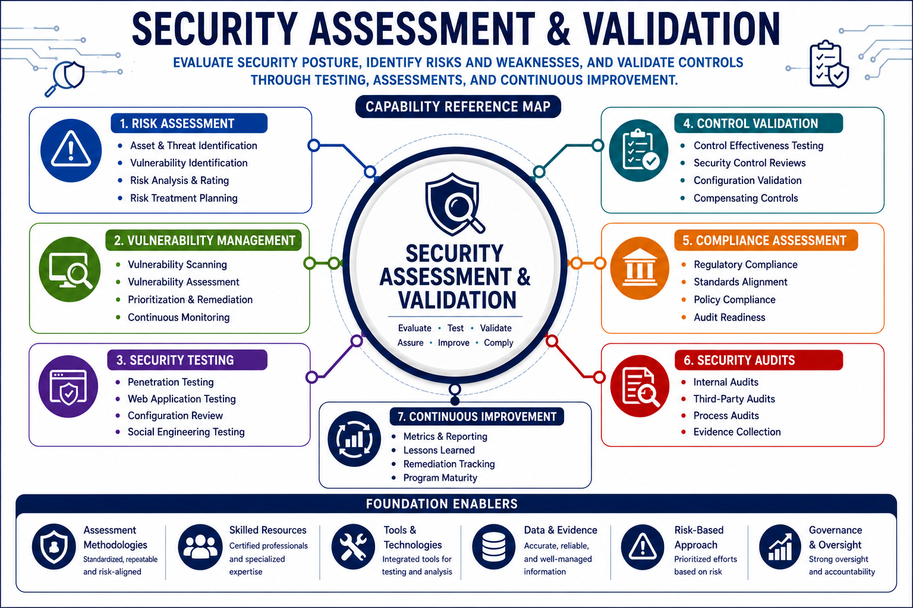

# Security Assessment & Validation

Security Assessment & Validation focuses on evaluating the effectiveness of security controls, verifying compliance with organizational requirements, identifying weaknesses, and providing assurance that security objectives are being achieved.

This capability encompasses security testing, vulnerability assessments, penetration testing, audits, compliance validation, security metrics, and assurance activities.
## Capability Reference Map


---

# Why This Capability Matters

Security controls cannot be assumed to be effective.

Organizations must continuously assess, validate, and measure security capabilities to identify weaknesses, verify compliance, and support informed risk management decisions.

Assessment and validation activities provide assurance that security controls operate as intended and continue to support business objectives.

---

# Architecture Perspective

Assessment provides visibility into security effectiveness and drives continuous improvement.

```text
Security Requirements
          ↓
Control Implementation
          ↓
Assessment
          ↓
Validation
          ↓
Reporting
          ↓
Remediation
          ↓
Continuous Improvement
```

Assessment activities verify that security architectures remain aligned with organizational risk tolerance and operational requirements.

---

# Core Functions

## Security Assessment Strategy

* Internal assessments
* External assessments
* Independent assessments
* Risk-based assessment planning
* Assurance programs

---

## Vulnerability Assessment

* Asset discovery
* Vulnerability identification
* Exposure analysis
* Risk prioritization
* Remediation validation

---

## Penetration Testing

* Security validation
* Adversarial simulation
* Red team exercises
* Purple team collaboration
* Attack path analysis

---

## Security Control Testing

* Technical control validation
* Administrative control validation
* Physical control validation
* Configuration reviews
* Security effectiveness testing

---

## Application Security Validation

* Code review
* Static analysis
* Dynamic analysis
* Interface testing
* Security testing integration

---

## Compliance Validation

* Regulatory compliance
* Policy compliance
* Standard compliance
* Control verification
* Audit preparation

---

## Security Metrics & Measurement

* Key Performance Indicators (KPIs)
* Key Risk Indicators (KRIs)
* Security scorecards
* Trend analysis
* Maturity measurement

---

## Security Reporting

* Assessment findings
* Risk reporting
* Executive reporting
* Remediation tracking
* Exception management

---

## Security Audits

* Internal audits
* External audits
* Independent reviews
* Compliance audits
* Assurance reviews

---

# Security Decision Patterns

## Vulnerability Assessment vs Penetration Testing

Vulnerability Assessment:

Identifies weaknesses.

Penetration Testing:

Attempts to exploit weaknesses.

---

## Assessment vs Audit

Assessment:

Evaluates effectiveness.

Audit:

Evaluates compliance and adherence.

---

## Finding vs Risk

Finding:

Observed condition.

Risk:

Potential business impact.

---

## Validation vs Verification

Verification:

Confirms implementation.

Validation:

Confirms effectiveness.

---

## KPI vs KRI

KPI:

Measures performance.

KRI:

Measures risk exposure.

---

# Related Security Architecture Patterns

This capability directly supports:

* Vulnerability Management Lifecycle
* Security Monitoring Model
* Risk Management Process
* Secure Development Lifecycle
* Continuous Improvement Programs

Refer to:

`references/security-architecture-patterns.md`

for related architecture patterns.

---

# Key Takeaways

* Security controls must be continuously evaluated.
* Assessment provides visibility into effectiveness.
* Validation confirms controls operate as intended.
* Vulnerability management reduces risk exposure.
* Audits provide assurance and compliance verification.
* Metrics support informed decision-making.
* Continuous improvement strengthens organizational security.

---

# Related Capabilities

This capability has strong relationships with:

* Governance, Risk & Compliance
* Security Architecture & Engineering
* Security Operations & Resilience
* Secure Application & Software Security

Assessment and validation provide assurance that enterprise security capabilities remain effective, compliant, and aligned with business objectives.
