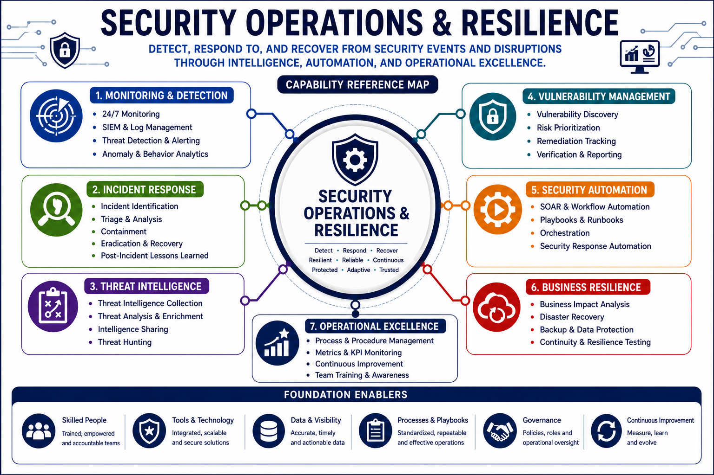

# Security Operations & Resilience

Security Operations & Resilience focuses on the continuous protection, monitoring, detection, response, recovery, and improvement of enterprise security capabilities. It ensures organizations can identify threats, respond to incidents, maintain operational continuity, and recover from disruptions.

This capability encompasses security monitoring, incident response, digital forensics, vulnerability management, disaster recovery, business continuity, physical security, and operational resilience.
## Capability Reference Map



---

# Why This Capability Matters

Security is not a one-time implementation.

Organizations must continuously monitor their environments, detect threats, respond to incidents, recover from disruptions, and improve operational effectiveness.

Effective security operations enable organizations to:

* Detect malicious activity
* Respond to security incidents
* Minimize business impact
* Recover critical services
* Maintain operational resilience
* Support regulatory and legal requirements

Security operations transform security controls into active defense capabilities.

---

# Architecture Perspective

Operational security depends on visibility, response, and resilience.

```text
Security Controls
         ↓
Monitoring
         ↓
Detection
         ↓
Analysis
         ↓
Response
         ↓
Recovery
         ↓
Continuous Improvement
```

Security operations provide the feedback loop that validates and strengthens enterprise security.

---

# Core Functions

## Security Monitoring

* Security Information and Event Management (SIEM)
* Continuous monitoring
* Log management
* Threat detection
* Security analytics
* User and Entity Behavior Analytics (UEBA)

---

## Threat Detection

* Intrusion Detection Systems (IDS)
* Intrusion Prevention Systems (IPS)
* Threat intelligence
* Threat hunting
* Egress monitoring
* Behavioral analytics

---

## Digital Investigations & Forensics

* Evidence collection
* Evidence preservation
* Chain of custody
* Forensic analysis
* Incident documentation
* Investigative procedures

---

## Incident Response

* Detection
* Analysis
* Containment
* Eradication
* Recovery
* Lessons learned

---

## Configuration Management

* Secure baselines
* Configuration control
* Asset provisioning
* Configuration monitoring
* Automation

---

## Vulnerability Management

* Vulnerability discovery
* Risk assessment
* Prioritization
* Remediation
* Validation
* Continuous monitoring

---

## Security Control Operations

* Firewalls
* IDS/IPS
* Anti-malware
* Sandboxing
* Honeypots
* Security service integrations

---

## Recovery & Resilience

* Backup strategies
* High availability
* Fault tolerance
* Recovery planning
* System resilience

---

## Disaster Recovery

* Recovery planning
* Recovery sites
* Restoration procedures
* Communications planning
* Recovery testing

---

## Business Continuity

* Continuity planning
* Operational recovery
* Continuity exercises
* Crisis management
* Organizational resilience

---

## Physical Security Operations

* Perimeter protection
* Facility security
* Access monitoring
* Environmental controls

---

## Personnel Security & Safety

* Security awareness
* Insider threat awareness
* Emergency response
* Personnel safety programs

---

# Security Decision Patterns

## Detection vs Prevention

Detection:

Identifies suspicious activity.

Prevention:

Attempts to stop activity before impact.

---

## Incident Response vs Digital Forensics

Incident Response:

Focuses on containment and recovery.

Digital Forensics:

Focuses on evidence collection and investigation.

---

## Containment vs Eradication

Containment:

Limits impact and spread.

Eradication:

Removes the root cause.

---

## Backup vs High Availability

Backup:

Supports recovery.

High Availability:

Supports continuous operations.

---

## Business Continuity vs Disaster Recovery

Business Continuity:

Maintains business operations.

Disaster Recovery:

Restores technology services.

---

## Recovery vs Restoration

Recovery:

Returns services to operation.

Restoration:

Returns systems to normal state.

---

# Related Security Architecture Patterns

This capability directly supports:

* Incident Response Lifecycle
* Security Monitoring Model
* Vulnerability Management Lifecycle
* Business Continuity & Disaster Recovery
* Defense in Depth

Refer to:

`references/security-architecture-patterns.md`

for related architecture patterns.

---

# Key Takeaways

* Security operations provide continuous protection.
* Monitoring enables visibility and threat detection.
* Incident response minimizes business impact.
* Digital forensics supports investigations and evidence preservation.
* Vulnerability management reduces exposure to threats.
* Recovery planning supports organizational resilience.
* Continuous improvement strengthens long-term security effectiveness.

---

# Related Capabilities

This capability has strong relationships with:

* Governance, Risk & Compliance
* Identity & Access Security
* Network & Infrastructure Security
* Security Assessment & Validation
* Secure Application & Software Security

Security operations serve as the operational backbone of enterprise security and resilience.
