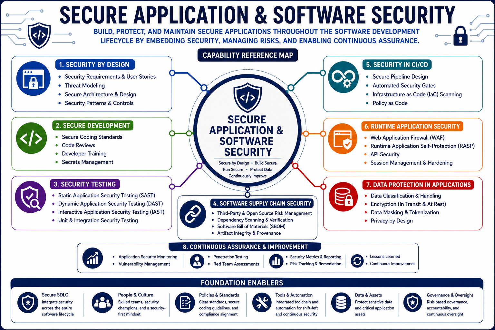

# Secure Application & Software Security

Secure Application & Software Security focuses on integrating security throughout the software lifecycle, protecting applications from vulnerabilities, reducing software supply chain risks, and ensuring software systems operate securely in production environments.

This capability encompasses secure software development, application security testing, secure coding practices, DevSecOps, software assurance, and software supply chain security.

## Capability Reference Map



---

# Why This Capability Matters

Applications process critical business data, support essential business functions, and often serve as primary entry points into organizational environments.

Security weaknesses introduced during design, development, deployment, or maintenance can result in:

* Data breaches
* Service disruptions
* Unauthorized access
* Regulatory violations
* Financial losses
* Reputational damage

Secure software practices help organizations reduce risk while delivering reliable and resilient applications.

---

# Architecture Perspective

Security should be integrated throughout the software lifecycle rather than added after development.

```text
Business Requirements
          ↓
Secure Design
          ↓
Development
          ↓
Security Testing
          ↓
Deployment
          ↓
Operations
          ↓
Continuous Improvement
```

Security becomes most effective when embedded into every phase of software development and operations.

---

# Core Functions

## Secure Development Lifecycle

* Secure requirements
* Secure design
* Secure development
* Secure testing
* Secure deployment
* Secure maintenance
* Secure retirement

---

## Development Methodologies

* Agile
* Waterfall
* DevOps
* DevSecOps
* Continuous Improvement Models

---

## Secure Development Ecosystems

* Integrated Development Environments (IDE)
* Source Code Repositories
* Build Systems
* Dependency Management
* Software Configuration Management

---

## Application Security Testing

* Static Application Security Testing (SAST)
* Dynamic Application Security Testing (DAST)
* Interactive Application Security Testing (IAST)
* Software Composition Analysis (SCA)
* Security Code Reviews

---

## Secure Coding Practices

* Input validation
* Output encoding
* Secure authentication
* Secure session management
* Error handling
* Logging and auditing

---

## Software Supply Chain Security

* Open-source software management
* Third-party software assessment
* Dependency security
* Software Bill of Materials (SBOM)
* Software integrity verification

---

## CI/CD Security

* Pipeline security
* Build validation
* Artifact integrity
* Automated security testing
* Deployment controls

---

## Software Risk Management

* Security risk assessments
* Vulnerability management
* Threat modeling
* Risk remediation
* Security assurance

---

## Cloud & Modern Application Security

* SaaS security considerations
* PaaS security considerations
* API security
* Container security
* Serverless security
* Microservices security

---

# Security Decision Patterns

## DevOps vs DevSecOps

DevOps:

Focuses on development and operations efficiency.

DevSecOps:

Integrates security throughout development and operations.

---

## SAST vs DAST

SAST:

Analyzes source code and application components.

DAST:

Tests running applications.

---

## Vulnerability vs Security Defect

Vulnerability:

A weakness that may be exploited.

Security Defect:

A flaw introduced during development.

---

## Open Source vs Proprietary Software Risk

Open Source:

Transparency and community review.

Proprietary:

Vendor-controlled development and support.

Both require security evaluation and risk management.

---

## Threat Modeling vs Security Testing

Threat Modeling:

Identifies potential attack scenarios before implementation.

Security Testing:

Validates security after implementation.

---

# Related Security Architecture Patterns

This capability directly supports:

* Secure Development Lifecycle
* Defense in Depth
* Zero Trust Architecture
* Vulnerability Management Lifecycle
* Shared Responsibility Model

Refer to:

`references/security-architecture-patterns.md`

for related architecture patterns.

---

# Key Takeaways

* Security should be integrated throughout the software lifecycle.
* Secure design reduces downstream security risks.
* Security testing validates application security controls.
* DevSecOps enables continuous security integration.
* Software supply chain security is essential in modern development.
* Secure coding practices reduce vulnerabilities.
* Continuous assessment improves software resilience.

---

# Related Capabilities

This capability has strong relationships with:

* Security Architecture & Engineering
* Identity & Access Security
* Security Assessment & Validation
* Security Operations & Resilience

Secure software development enables organizations to deliver resilient, trustworthy, and secure applications that support business objectives.
