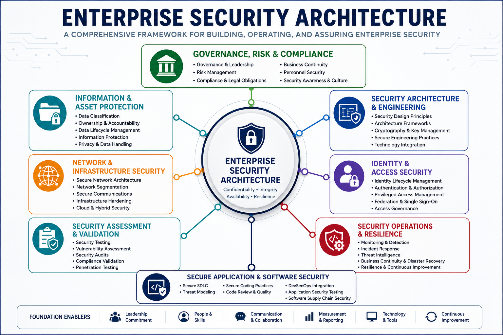

# Enterprise Security Architecture Review Guide

A comprehensive security architecture reference covering governance, risk management, information protection, security engineering, network security, identity and access security, security operations, security assessment, and secure software development.



## Security Capabilities

| Domain                                                                             | Description                                                                                                      |
| ---------------------------------------------------------------------------------- | ---------------------------------------------------------------------------------------------------------------- |
| [Governance, Risk & Compliance](01-governance-risk-compliance/)                    | Governance, risk management, compliance, business continuity, personnel security, and security awareness.        |
| [Information & Asset Protection](02-information-asset-protection/)                 | Information classification, asset management, data lifecycle management, retention, and data protection.         |
| [Security Architecture & Engineering](03-security-architecture-engineering/)       | Secure design principles, security models, cryptography, system architecture, and engineering.                   |
| [Network & Infrastructure Security](04-network-infrastructure-security/)           | Network architecture, segmentation, secure communications, cloud networking, and infrastructure protection.      |
| [Identity & Access Security](05-identity-access-security/)                         | Authentication, authorization, federation, identity lifecycle management, and access governance.                 |
| [Security Assessment & Validation](06-security-assessment-validation/)             | Security testing, vulnerability assessment, auditing, assurance, and compliance validation.                      |
| [Security Operations & Resilience](07-security-operations-resilience/)             | Monitoring, incident response, digital forensics, disaster recovery, business continuity, and resilience.        |
| [Secure Application & Software Security](08-secure-application-software-security/) | Secure software development, secure coding, DevSecOps, application security, and software supply chain security. |

## Overview

Enterprise security is built upon interconnected domains...
A comprehensive security architecture reference covering governance, risk management, information protection, security engineering, network security, identity and access security, security operations, security assessment, and secure software development.

This repository is organized into eight core security domains and is designed to provide structured coverage of enterprise security concepts, architectural principles, operational practices, and governance frameworks.

---

## Repository Overview

Enterprise security is built upon interconnected domains that collectively support confidentiality, integrity, availability, resilience, compliance, and risk management.

This repository provides a structured approach to understanding and reviewing security concepts across the enterprise security landscape through architecture-focused documentation, operational workflows, security frameworks, and domain-specific reference material.

The content is organized to emphasize:

* Security architecture principles
* Risk-based decision making
* Governance and compliance
* Identity and access security
* Network and infrastructure security
* Security operations and resilience
* Security assessment and assurance
* Secure software development practices

---

## Repository Structure

```text
enterprise-security-architecture-review/

├── Governance, Risk & Compliance
├── Information & Asset Protection
├── Security Architecture & Engineering
├── Network & Infrastructure Security
├── Identity & Access Security
├── Security Assessment & Validation
├── Security Operations & Resilience
├── Secure Application & Software Security
│
├── Security Architecture Patterns
├── Security Decision Patterns
└── Security Capability Matrix


## Domain Coverage

### Domain 1 – Governance, Risk & Compliance

* Security Governance
* Risk Management
* Compliance
* Legal and Regulatory Requirements
* Business Continuity
* Security Awareness
* Personnel Security
* Supply Chain Risk Management

### Domain 2 – Information & Asset Protection

* Information Classification
* Asset Management
* Data Lifecycle Management
* Data Retention
* Data Destruction
* Data Protection Controls
* Privacy Requirements

### Domain 3 – Security Architecture & Engineering

* Secure Design Principles
* Security Models
* Security Engineering
* Cryptography
* Physical Security
* System Lifecycle Security
* Architecture Risk Assessment

### Domain 4 – Network & Infrastructure Security

* Secure Network Architecture
* Network Segmentation
* Secure Protocols
* Cloud Networking
* Wireless Security
* Network Monitoring
* Secure Communications

### Domain 5 – Identity & Access Security

* Identity Management
* Authentication
* Authorization
* Federation
* Single Sign-On
* Identity Lifecycle Management
* Access Governance

### Domain 6 – Security Assessment & Validation

* Security Testing
* Vulnerability Assessment
* Penetration Testing
* Security Auditing
* Security Metrics
* Assurance Programs

### Domain 7 – Security Operations & Resilience

* Security Monitoring
* Incident Response
* Digital Forensics
* Vulnerability Management
* Disaster Recovery
* Business Continuity
* Physical Security Operations

### Domain 8 – Secure Application & Software Security

* Secure Development Lifecycle
* Application Security
* Secure Coding
* Software Supply Chain Security
* DevSecOps
* Application Security Testing

---

## Security Architecture Focus Areas

This repository places additional emphasis on the following domains:

### Governance, Risk & Compliance

Security leadership, governance frameworks, risk treatment strategies, compliance management, and executive decision-making.

### Network & Infrastructure Security

Secure network design, segmentation strategies, cloud networking, secure communications, and infrastructure protection.

### Identity & Access Security

Identity lifecycle management, authentication strategies, authorization models, federation, and access governance.

### Security Operations & Resilience

Monitoring, incident response, forensic investigations, vulnerability management, disaster recovery, and business continuity.

---

## Repository Structure

```text
enterprise-security-architecture-review/

├── images/
├── references/
│
├── 01-governance-risk-compliance/
├── 02-information-asset-protection/
├── 03-security-architecture-engineering/
├── 04-network-infrastructure-security/
├── 05-identity-access-security/
├── 06-security-assessment-validation/
├── 07-security-operations-resilience/
└── 08-secure-application-software-security/
```

---

## Future Enhancements

Planned additions include:

* Domain reference guides
* Security architecture diagrams
* Domain review posters
* Security decision frameworks
* Security operations workflows
* Identity architecture models
* Network security architecture patterns
* Governance and risk management frameworks
* Objective traceability matrix
* Security architecture visualizations

---

## Project Roadmap

### Phase 1

* Repository structure
* Domain mapping
* Objective traceability

### Phase 2

* Domain reference documentation
* Architecture-focused content
* Review guides

### Phase 3

* Security architecture diagrams
* Domain visual maps
* Security workflows

### Phase 4

* Domain summary posters
* Master security architecture poster
* Comprehensive review material

---

## Purpose

The goal of this project is to create a structured enterprise security architecture reference that can be used for security architecture review, professional development, knowledge sharing, and security domain exploration.

The repository is intended to serve as a long-term reference covering the breadth of modern enterprise security practices across governance, architecture, operations, engineering, and software security.
